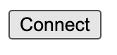

# html-fund-me

 *[HTML Fund Me](https://www.youtube.com/watch?v=sas02qSFZ74&t=9422s)*

You can usually just double click the file to "run it in the browser". Or you can right click the file in your VSCode and run "open with live server" if you have the live server VSCode extension (ritwickdey.LiveServer).

And you should see a small button that says "connect".



Hit it, and you should see metamask pop up.

## Execute a transaction - Local EVM


> Foundry

1. You'll need to open up a second terminal and run:

```
make deploy
```

Then, in a second terminal
```
mox run deploy --network anvil
```

This will deploy a sample contract and start a local hardhat blockchain. 

After you've deployed with either foundry or moccasin, you can should then:

2. Update your `constants.js` with the new contract address.

In your `constants.js` file, update the variable `contractAddress` with the address of the deployed "FundMe" contract. You'll see it near the top of the hardhat output.

3. Connect your [metamask](https://metamask.io/) to your local hardhat blockchain.

> **PLEASE USE A METAMASK ACCOUNT THAT ISNT ASSOCIATED WITH ANY REAL MONEY.**
> I usually use a few different browser profiles to separate my metamasks easily.

In the output of the above command, take one of the private key accounts and [import it into your metamask.](https://metamask.zendesk.com/hc/en-us/articles/360015489331-How-to-import-an-Account)

Additionally, add your localhost with chainid 31337 to your metamask.

4. Refresh the front end, input an amount in the text box, and hit `fund` button after connecting

## Execute a transaction - zkSyn


Then, run:
```
make deploy-zk
```

This will deploy a sample contract and start a local zkSync node.

1. Update yor `constants.js` with the new contract address.

In your `constants.js` file, update the variable `contractAddress` with the address of the deployed "FundMe" contract. You'll see it after you run `make deploy-zk`.

2. Connect your [metamask](https://metamask.io/) to your local zkSync blockchain.

> [IMPORTANT] **PLEASE USE A METAMASK ACCOUNT THAT ISNT ASSOCIATED WITH ANY REAL MONEY.**
> I usually use a few different browser profiles to separate my Metamasks easily.

Additionally, add your zkSync node with chainid `260` to your metamask.

3. Refresh the front end, input an amount in the text box, and hit `fund` button after connecting

# Thank you!


